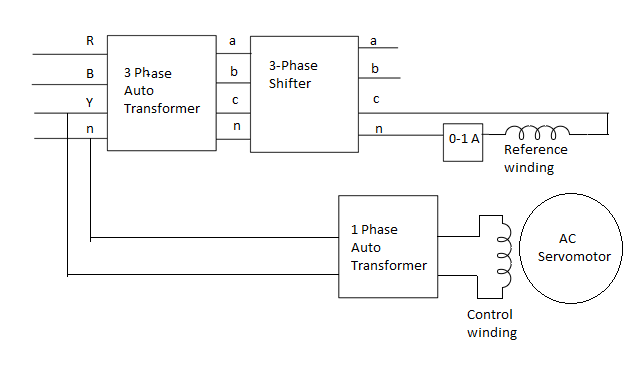

### Procedure

								

 

[Fig : Circuit diagram of experimental set-up ]
 
								 
								
<b>Steps to perform the simuation</b> 
		<ol>								
	   <li>The connections should be made as per the circuit diagram above, in simulation page there are blue dots to connect instruments or machines through wires
	   within the experimental set up. Make those connections as follows(x-y,drag connecting wire from point x and drop on point y):
	   1-12,2-11,7-6,8-5,4-35,14-31,32-18,33-22,34-23,15-19,19-23,16-25,20-26,27-24,28-23,38-23.</li> 	  
	   <li>Click on 'Check Connection' button to check whether the connections are proper or not. If alert comes as 'wrong connection' ,review the connections made
	   and click on the incorrectly connected wire to delete it.</li> 	 
	   <li> Click on plus sign of 'Control Phase' knob to provide the control phase voltage to 220v. the corresponding box with control phase shows the voltage applied.</li> 
	   <li>Click on plus sign of 'Reference Phase' knob to provide the Reference phase voltage to 220v. the corresponding box with reference phase shows the voltage applied.This will be fixed throughout the experiment </li>  
	   <li>Click on the red switch to switch on the regulated DC power supply.Click on plus sign of dc supply voltage knob(just beside the switch)
	       to increase the voltage value to 4.9 v. The motor will run with some speed.The corresponding box above the motor shows the speed value
		   in rpm .At first it will run with no load speed.</li> 
	   <li>There are weights(g) in the pink dotted box.Drag weights from that box to drop them on the blue dotted box,the 'Chosen Weight(g)' value would be shown
	        in a box.The weight must be chosen as follows: start with 20,40,50,70,100,120,140,160,180,200.More than one weight may be needed to make the total weight as said above. </li> 
	   <li>Each time for a weight combination in the level indicator the green water bubble will move from center position.
	       Click on plus sign of Current knob of regulated dc power supply,increase the current value slowly untill the green water bubble
		   comes to center position.The speed of the motor will change with change of weights. </li> 
	   <li> After bringing the bubble to center position and the speed change click on 'Show Table' button to take observation data.
	     Then change the weight again and follow the above step.</li> 		 
	   <li> If in any case ,incorrect observation is taken mistakenly(for ex:after changing the weight if observation is taken too early before the motor speed changes,
	        then there will be same data in two consecutive rows in a table.That will result in wrong plot),then click on 'Delete Row' button to delete that particular observation table row and take the reading again.	 
	   <li>After changing the weights upto 200g with control voltage 220v,change the control phase voltage to 200v and repeat the above steps.
	       Follow the same steps for control phase voltage to 180v.</li> 	
	   <li>After taking observations for three different control voltages under three individual table,click on 'Plot' button to observe the 
	       Torque Vs. Speed plot.Click on 'Transfer Function' button to see the Transfer Function of motor.</li> 
	   <li>Now click on minus signs to bring back all the knobs to zero position and switch off the dc regulated supply.</li> 	 
	     </ol>		    
								

							
   