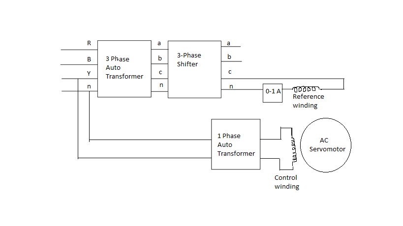
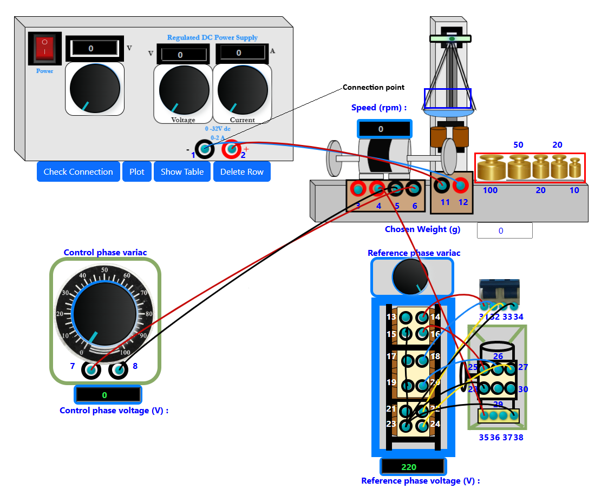
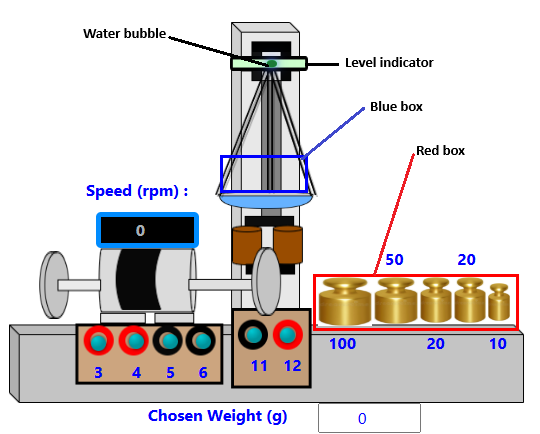
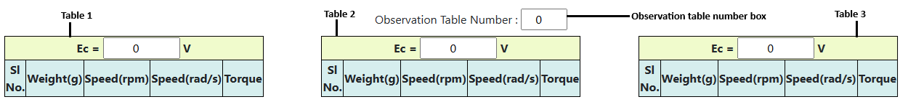
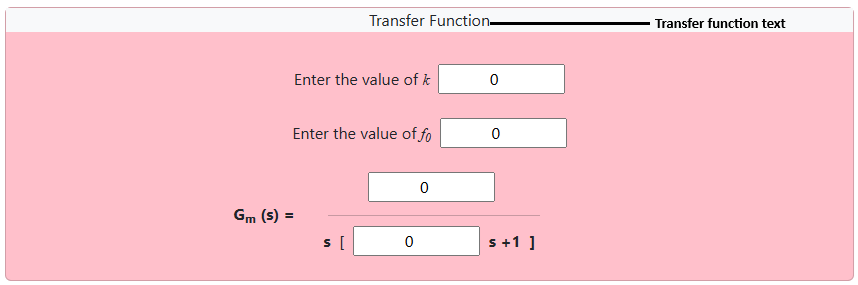

### Procedure

							

Fig. 1. Circuit diagram of experimental setup

**Steps to perform the simuation**

<ol>						

<li> Make wire connections as follows in simulation page. (Fig. 2): 
<ul>
<li><b>Note:</b> Example: connection point 1 - connection point 2 (drag the wire from connection point 1 by pressing left mouse button and release on connection point 2).</li>
<li>1-12, 2-11, 7-6, 8-5, 4-35, 14-31, 32-18, 33-22, 34-23, 15-19, 19-23, 16-25, 20-26, 27-24, 28-23, 38-23.</li>

 

 								
<b style="text-align:center">Fig. 2. Wire connection in simulation page</b> 

 

<li><b>Note:</b> Any wire connection can be deleted by clicking on the connected wire if required.</li></ul></li> 

<li><ul><li>Rotate the 'Reference phase' variac to provide the reference phase voltage to 220 V.</li>
<li><b>Note:</b> To rotate any knob put the mouse cursor on the knob handle (blue line on the knob), a hand symbol will be showing. Press left mouse button, rotate clockwise to increase or anticlockwise to decrease values.</li>
<li><b>Note:</b> If the desired value does not appear while rotating the knob in one attempt, try rotating it back and forth to reach the correct value. If the knob becomes unresponsive at any time, please refresh the page and repeat the experiment.</li>
<li>The corresponding box with reference phase variac shows the voltage applied.</li>
<li>This will be fixed throughout the experiment. Rotate the 'Control phase' variac to provide the control phase voltage to 220 V.</li>
<li>The corresponding box with control phase variac shows the voltage applied.</li>
</ul>
</li> 

<li><ul><li>Click on 'Check Connection' button to check whether the wire connections are proper or not.</li>
<li>If alert message is shown as 'wrong connection', examine the established connections and click on the incorrectly linked wire to remove it.</li></ul></li> 

<li><ul><li>Click on the red switch to switch on the regulated dc power supply.</li>
<li>Rotate the dc supply voltage knob (beside the switch) to increase the voltage value to 4.9 V.</li>
<li>The motor will run with no load speed first. The corresponding box above the motor shows the speed value in rpm .</li></ul></li> 

<li><ul><li>There are weights (g) in the red box. Drag weights from that box to drop them on the blue box. (Fig. 3)</li>
<li>The total weight (g) value would be shown in corresponding box beside 'Chosen Weight (g)'.</li>
<li>The weight must be chosen as follows:</li>
<li>Start with 20 g, then increase the weight by 20 g like 40, 60, 80, 100, 120, 140, 160, 180 and 200 g.</li>
<li>More than one weight may be used to increase the weight value. </li></ul></li> 

 

 								
<b style="text-align:center">Fig. 3. Placing weights in simulation page</b> 

 

<li><ul><li>After a weight is chosen the green water bubble in the level indicator will move from center position.</li>
<li>Rotate the 'Current' knob of regulated dc power supply, increase the current value slowly untill the green water bubble
comes to center position.</li>
<li>The speed of the motor will change with the change in weights. </li></ul></li> 

<li> <ul><li>After the bubble comes to the center position and the speed of the motor gets changed, enter 1 in the 'Observation Table Number' box. (Fig. 4)</li>
<li><b>Note:</b> There will be observations for three successive control phase voltages in three different tables, for first one the number entered will be 1. It means 
the first table will be filled.</li>
<li>Click on 'Show Table' button to take observation data. Change the weight again (choose the next weight after 20 g as said in step 5) and follow steps 5-7.</li></ul></li> 

 

 								
<b style="text-align:center">Fig. 4. Observation Table Number box in simulation page</b> 

 

<li><ul><li><b>Note :</b> If in any case, incorrect observation is taken mistakenly (e.g. after changing the weight if observation is taken too early before the motor speed changes,
then there will be same data in two consecutive rows in a table. That will result in wrong plot).</li>
<li>Then click on 'Delete Row' button to delete that particular observation table row and take the reading again.</li></ul></li> 

<li><ul><li>After changing the weights upto 200 g with control phase voltage 220 V, bring the current knob to its minimum value and
change the control phase voltage to 200 V.</li>
<li>Repeat the steps 5-7.  In this case enter 2 in the 'Observation Table Number' box (it means the second table will be filled).</li>
<li>Follow again steps 5-7 for the control phase voltage 180 V and in this case enter 3 in the 'Observation Table Number' box to fill the third table .</li></ul></li> 

<li>After taking observations for three different control phase voltages under three individual table, click on 'Plot' button to observe the Torque Vs. Speed plot.</li>  

<li><ul><li>Calculate and enter the values of <i>K</i> and <i>f</i>0 from the plot (formula for the calculation is explained in 'Theory').</li>
<li>Click on the text 'Transfer Function' in the pink box at the bottom of the simulation page to see the transfer function of motor. (Fig. 5)</li></ul></li> 

 

 								
<b style="text-align:center">Fig. 5. Transfer Function text in simulation page</b> 

 

<li>Now bring back all the knobs and variacs to minimum value and switch off the dc regulated supply.</li> 

</ol>
