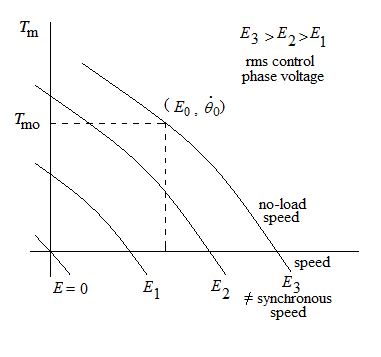

# Theory
**Servomotors:**

Servomotors ( control motors) are motors which are designed and built for use in feedback control systems. 
They have high speed of response and they are made for d.c. as well as for a.c. operation. These motors usually fractional horsepower motors having low efficiency.

**Two-phase servomotors:**

An a.c. servomotor is an induction motor with two primary windings mutually displaced in magnetic position from one another by 90 electrical degrees.It has low inertia and high-resistance rotor, thus, giving a speed-torque curve that is linear in shape from no load speed to stand-still.
It is designed for operation with a constant voltage applied to one of the windings , called the fixed phase , while a time-displaced adjustable voltage is impressed on the other winding which is called the control winding.
The two phase induction motor is the most important machine which is used as a servomotor. This is because:

1- No brushes and slip-rings are used. Thus, less maintenance is required and the motor is rugged and robust in construction.

2- The motor requires only a simple control amplifier.

**Construction:**

								

**Stator:**

The stator is similar to that of the split-phase induction motor. It has two windings called control winding and reference winding displaced by 90 electrical angle with each other.The two windings may be identical or not depending on the applications.

                

**Rotor:**

There are three different rotor types. The squirral cage rotor, the solid iron rotor and the drag cup rotor.The squirral-cage rotor is usually small in diameter to keep the mechanical inertia as low as possible and the rotor has high resistance in order to obtain linear speed-torque characteristics. The rotor winding is skewed in order to:

1- make the motor run quietly by reducing the magnetic hum.

2- reduce the locking tendency of the rotor, the tendency of the rotor teeth to remain under the stator teeth due to direct magnetic attraction between them.				
								
The drag-cup rotor consists of a cup of a nonmagnetic conducting material such as copper.
This rotor is used for low output motors (few watts) in order to minimize the moment of inertia.
The drag-cup rotor can be described as a special from of squirral-cage rotor in which the rotor teeth are removed,the rotor core is held stationary and the squirral cage bars and the end rings are replaced by a cylinderical cup.

	

 $$ Let \ us \ choose (\dot{\theta}_0,E_0) \ be \ the \ operating \ point \ of \ the \ ac \ motor \ and \ consequently \ expanding \ the \ function \ f(……) \ about \ this \ point \ we \ have $$

$$ T_{m}=T_{m0}+\frac{\partial{T_{m}}}{\partial{E}}\vert\dot{\theta}_{0}E_{0}(E-E_{0})+\frac{\partial{T_{m}}}{\partial{\dot{\theta}}}\vert\dot{\theta}_{0}E_{0}(\dot{\theta}-\dot{\theta}_{0}).......(1) $$

Where the higher order terms in the Taylor series expansion are neglected. Let

J = movement of inertia of rotor and disc

F = coefficient of viscous friction

$$ T_L \ = \ load \ torque $$	
						
								
