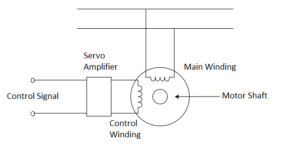
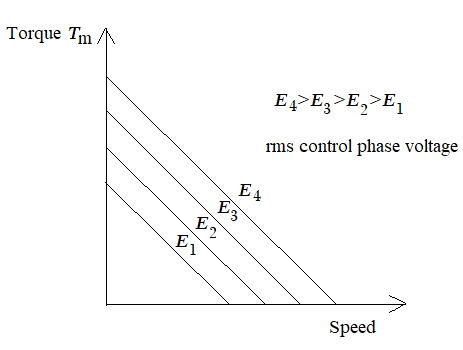

# Theory
**Servomotors:**

Servomotors ( control motors) are motors which are designed and built for use in feedback control systems. 
They have high speed of response and they are made for d.c. as well as for a.c. operation. These motors usually fractional horsepower motors having low efficiency.

	
<b>Fig 1: Schematic representation of a Servomotor</b>

The two phase induction motor is used as a servomotor. This is because: 

1. No brushes and slip-rings are used. Thus, less maintenance is required and the motor is rugged and robust in construction. 

2. The motor requires only a simple control amplifier.  

A schematic of the two-phase induction motor is shown in fig 2. The motor consists of a stator with two distributed windings displaced by 90 electrical degrees apart. Under normal operating conditions in control applications, a fixed voltage from a constant voltage source is applied to one phase called the fixed or the reference phase (Eref). 
The other phase is called the control phase, energized by a voltage (Ec) which is 90 degrees out of phase with respect to the voltage of the reference phase. The control phase voltage is usually supplied from a servo amplifier, the voltage has a variable amplitude and polarity. The direction of rotation of the motor reverses when the control phase signal Changes its sign. The rotor is squirrel cage or drag-cup type in structure.

								

	
<b>Fig 2: Schematic of a Two-Phase Induction Motor</b>

Unlike a dc motor the torque-speed curve of a two phase induction motor is quite nonlinear. Considering fig 3, as the reference phase voltage is kept fixed,
 the motor torque <i style="font-family:'Bodoni MT'">Tm</i> is a function of the speed and the control phase voltage and is represented by,

$$T_m = f ( \dot{\theta} , E  )...(1)$$

$$where, \ \dot{\theta} = \ speed , \  E = \ control \ phase \ voltage$$ 

 
<b>Fig 3: Speed-Torque characteristics of an ac Servomotor</b>

 	 

$$Let \ us \ choose \ (E_0,\dot{\theta}_0) \ be \ the \ operating \ point \ of \ the \ ac \ servomotor$$

 
Expanding equation (1) about the operating point with Taylor series expansion we have,

$$ T_m=T_{m0} + \frac{ \partial{T_m}}{ \partial{E}} \vert  \dot { \theta}_0 E_0 (E-E_0) + \frac{ \partial{T_m}}{ \partial{ \dot{ \theta}}}  \vert  \dot {\theta}_0 E_0 ( \dot{ \theta}- \dot{ \theta}_0).......(2) $$

Where the higher order terms in the Taylor series expansion are neglected. Let

<i style="font-family:'Bodoni MT'">J</i> = Moment of inertia of rotor and disc

<i style="font-family:'Bodoni MT'">f</i> = Coefficient of viscous friction

<i style="font-family:'Bodoni MT'">TL</i> = Load torque

$$ K = \frac{ \partial{T_m}}{ \partial{E}} \vert \dot{ \theta}_0 E_0 \dot{ \theta} $$

$$ f_0= \frac{ \partial{T_m}}{ \partial{ \dot{ \theta}}} \vert \dot{ \theta}_0 E_0 $$

Then we can write the following equations 

$$ T_{m0}=J  \ddot{ \theta}_0 + f \dot{ \theta}_0 + T_L ................(3) $$

$$ T_m= J({ \ddot{ \theta}_0}+ \Delta{ \ddot{ \theta}})+f({ \dot{ \theta}_0} + \Delta{ \dot{ \theta}}) T_L.........(4) $$

In view of (1) – (3), the torque equation in incremental notation can be written as:

$$ \Delta{T_{m}} =J\Delta{\ddot{\theta}}+ f\Delta{\dot{\theta}}=K\Delta{E}-f_{0}\Delta{\dot{\theta}} $$

Hence, the incremental motor transfer function is:

$$ G_{M}(s)=\frac{\theta(s)}{E(s)}=\frac{K}{S[Js+(f+f_{0})]} $$

$$ =\frac{K_{m}}{s(T_{m}s+1)} $$

where,

$$ K_m =\frac{K}{f+f_{0}}, T_m= \frac{J}{f+f_{0}} $$

$$ k_m  = DC\ gain\ of\ the\ system ,\  T_m = Motor\ Time\ Constant $$

$$K = \frac{Change \ in \ torque \ in \ N-m}{Change \ in \ control \ phase \ voltage \ E \ ( \ volt \ )} \ at \ constant \ speed \ in \ rad/sec$$

$$f_0 = \frac{Change \ in \ torque \ in \ N-m}{Change \ in \ speed \ (  \ rad/sec \ )} \ at \ constant \ control \ phase \ voltage \ E \ ( \ volt \ )$$

For linear analysis the torque – speed curves of a two phase induction motor are approximated by straight lines, as shown in fig 4.  

 

 
<b>Fig 4: Linear analysis of the torque – speed curves of a two phase induction motor</b>

 

<b>Calculation for <i style="font-family:'Bodoni MT'">Km</i> and <i style="font-family:'Bodoni MT'">&tau;m</i> from graph :</b> 
 

 
<b>Fig 5: Calculation for <i style="font-family:'Bodoni MT'">Km</i> and <i style="font-family:'Bodoni MT'">&tau;m</i></b>

 

Choose an operating point from the torque vs. speed graph, obtained from experiment. Let us consider operating point as (<i style="font-family:'Times New Roman'">A</i> gm-cm, <i style="font-family:'Times New Roman'">B</i> rad/sec) in fig 5 for
control phase voltage 180 V. <i style="font-family:'Times New Roman'">C</i> is the torque at constant speed <i style="font-family:'Times New Roman'">B</i> rad/sec for control voltage of 200 V.

so,

$$K = \frac{(C - A) \times (9.81 \times 10^{-5})}{(200 - 180)} \ N-m \ / \ volt$$

Now consider a slope <i style="font-family:'Times New Roman'">AD</i> for constant control phase voltage 180 V. 
 Where <i style="font-family:'Times New Roman'">D</i> = torque (gm-cm) for speed <i style="font-family:'Times New Roman'">S</i> rad/sec. Hence,

$$-f_0 = \frac{(D - A)\times (9.81 \times 10^-5)}{(S - B)} \ N-m \ / \ rad/sec$$

 <i>f</i>0 is positive for a negative slope but it is negative for a positive slope.

Calculate the value of <i style="font-family:'Bodoni MT'">K</i> and <i>f</i>0 from graph.

						
							
